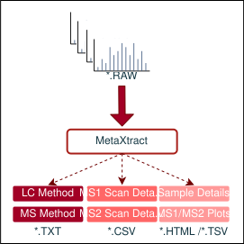

# MetaXtract

MetaXtract is a hybrid tool for extracting, analysing, and visualising data from **Thermo Fisher RAW** mass spectrometry files. It can be used via a **Graphical User Interface (GUI)**, a **Command Line Interface (CLI)**, or directly as a **Python library** for programmatic workflows.

<div align="center">

</div>
<div align="center">

[](https://www.biorxiv.org/content/10.1101/2025.11.12.687968v1)&nbsp;

</div>

---

## Features

- Reads native **Thermo RAW** files (Windows + Linux)
- GUI and CLI workflows
- Extracts:
  - File and instrument metadata
  - MS1 and MS2 scan headers
  - MS1 and MS2 technical trailer details
  - MS1 and MS2 peak lists with the extended peak list of MS2
- Exports data as:
  - CSV / TSV
  - Parquet (peak lists)
  - Interactive Plotly HTML reports
- Cross-sample visual comparisons
- Designed for downstream computational analysis

---

## Installation

### Requirements
- Python ≥ 3.9
- Thermo Fisher RAW access (DLLs included in the repository)

### Install dependencies

```bash
pip install numpy pandas pyarrow pyyaml tqdm plotly anndata h5py pythonnet PySide6
```

## Build Windows tool

```bash
pip install pyinstaller
```
If `PyQt6` is installed, it should be excluded from the installer. 

```bash
pyinstaller --noconfirm --onedir --console --name MetaXtract   --icon assets/icon.ico   --add-data "os_data;os_data"   --add-data "assets;assets"   --hidden-import=clr --hidden-import=System --hidden-import=pythonnet   --hidden-import=matplotlib.backends.backend_pdf --hidden-import=matplotlib.backends   --collect-all PySide6   --collect-all h5py   --collect-submodules h5py   --exclude-module PyQt6 --exclude-module PyQt6.sip --exclude-module PyQt6.QtCore --exclude-module PyQt6.QtGui --exclude-module PyQt6.QtWidgets   main.py
```
---
## Usage
### Running the GUI
```bash
python main.py
```
### Running the CLI
```bash
python main.py --config /path/to/config.yml
```
#### Configuration File (`config.yml`)

MetaXtract can be fully configured using a YAML configuration file.  
This allows reproducible, automated runs without passing long CLI arguments.

#### Example `config.yml`

```yaml
io:
  input:
    - path/to/sample.RAW
  output_dir: output

outputs:
  file_based_details: true
  ms_method: true # this option is not supported on Linux
  lc_method: true # this option is not supported on Linux
  ms2_peaklist_export: true
  ms1_peaklist_export: true
  ms2_technical_details_export: false
  ms1_technical_details_export: false
  hdf5_export: false

scan_header:
  MS1:
    select_all: false
    columns:
      Total Ion Current: true
      Scan Start Time (min): true
      Scan Mode: false
  MS2:
    select_all: true
    columns:
      Scan Mode: false

visualisation:
  enabled: true
  format: html
```
---
### GUI Options
#### Input / Output
- **Input RAW files:** One or multiple Thermo .RAW files.
- **Output directory:** Root folder where results are written (one subfolder per RAW).

#### File-based Outputs
**Writes a TSV file containing:** Instrument details, Scan counts, Run statistics, Sample information. 
**MS Method:** Extracts the MS method (`*_MS_method.txt`). # this option is not supported on Linux
**LC Method:** Extracts the LC method (`*_LC_method.txt`). # this option is not supported on Linux

#### Scan Header Extraction
- MS1 scan headers
- MS2 scan headers
Each allows: Selecting individual columns or Select all (complete MS1 / MS2). `Scan Mode` can be selected for both MS1 and MS2.

#### Output Column Naming
MetaXtract uses PSI-MS/mzML-style names where a clear controlled vocabulary term exists. Thermo trailer-extra fields without a direct PSI-MS match are prefixed with `thermo_`. Internally, old Thermo labels such as `Base Peak Mass` and `Retention Time (s)` are still recognized as source aliases, but new CSV exports use the names below.

| Output column | PSI-MS / mzML match | Notes |
|---|---|---|
| `Scan Start Time (min)` | `scan start time`, `MS:1000016` | Thermo returns retention time in minutes. Replaces old ambiguous `Retention Time (s)` / `Retention Time (min)`. |
| `Total Ion Current` | `total ion current`, `MS:1000285` | Direct match. |
| `Base Peak Intensity` | `base peak intensity`, `MS:1000505` | Direct match. |
| `Base Peak m/z` | `base peak m/z`, `MS:1000504` | Replaces old `Base Peak Mass`; the value is m/z, not neutral mass. |
| `Ion Injection Time (ms)` | `ion injection time`, `MS:1000927` | Direct match; unit is milliseconds. |
| `Collision Energy` | `collision energy`, `MS:1000045` | Direct match when the source value is absolute collision energy. |
| `Collision Energy (eV)` | `collision energy`, `MS:1000045` | Same concept with explicit electronvolt unit. |
| `Normalized Collision Energy (%)` | `normalized collision energy`, `MS:1000138` | Replaces old `HCD Energy` when Thermo reports a normalized percent value. |
| `Dissociation Method` | `dissociation method`, `MS:1000044` | Replaces old `Activation Type`. |
| `Mass Analyzer Type` | `mass analyzer type`, `MS:1000443` | Direct match. |
| `Detector Type` | `detector type`, `MS:1000026` | Direct match. |
| `Charge State` | `charge state`, `MS:1000041` | Direct match. |
| `Filter String` | `filter string`, `MS:1000512` | Replaces old `Scan Description`. |
| `Scan Window m/z Range` | `scan window lower limit`, `MS:1000501`; `scan window upper limit`, `MS:1000500` | Exported as a compact `lower-upper` range. |
| `Isolation Window Width (m/z)` | Derived from `isolation window lower offset`, `MS:1000828`, and `isolation window upper offset`, `MS:1000829` | Kept as width because that is what Thermo exposes directly. |
| `Selected Ion Intensity` | `peak intensity`, `MS:1000042`, in precursor selected-ion context | Replaces old `Precursor Intensity`. |
| `Experimental Precursor Monoisotopic m/z` | `experimental precursor monoisotopic m/z`, `MS:1003208` | Replaces old `Monoisotopic M/Z`. |
| `Sampling Frequency` | `sampling frequency`, `MS:1000029` | Only a direct match if the Thermo source value is signal sampling frequency. |
| `FAIMS Compensation Voltage` | `FAIMS compensation voltage`, `MS:1001581` | Replaces old `FAIMS CV`. |

Columns without a direct one-to-one PSI-MS scan-header term but still kept as general, non-vendor labels:

`Total Number of Peaks`, `Scan Mode`.

Columns intentionally marked as Thermo-specific because they are RAW trailer fields or instrument/vendor implementation details:

`thermo_Number of Channels`, `thermo_AGC`, `thermo_Micro Scan Count`, `thermo_Elapsed Scan Time (sec)`, `thermo_Average Scan by Inst`, `thermo_Orbitrap Resolution`, `thermo_API Process Delay`, `thermo_Dependency Type`, `thermo_Multi Inject Info`, `thermo_Master Scan Number`, `thermo_Access ID`, `thermo_Conversion Parameter I`, `thermo_Conversion Parameter A`, `thermo_Conversion Parameter B`, `thermo_Conversion Parameter C`, `thermo_Conversion Parameter D`, `thermo_Conversion Parameter E`, `thermo_Temperature Comp. (ppm)`, `thermo_RF Comp. (ppm)`, `thermo_Space Charge Comp. (ppm)`, `thermo_Resolution Comp. (ppm)`, `thermo_Number of LM Found`, `thermo_LM Correction (ppm)`, `thermo_RawOvFtT`, `thermo_Injection t0`, `thermo_Reagent Ion Injection Time (ms)`, `thermo_FAIMS Voltage On`, `thermo_Multiple Injection`.

#### Output
- CSV tables
- Optional interactive HTML plots (TIC, BPI, TNP, etc.)

#### Peak List Export
- **Export MS2 extended peak list (Parquet):** Per scan; `mz_array`, `intensity_array`, `resolution_array`, `noises_array`, `baselines_array`, `charges_array`.
- **Export MS1 peak list (Parquet):** Per scan; `mz_array`, `intensity_array` with centroid/profile flag.

#### Technical Details Export
- **Export MS2 technical details:** Writes `*_technical_details_ms2_*.csv` using `GetMoreMSInfos` for each MS2 scan.
- **Export MS1 technical details:** Writes `*_technical_details_ms1_*.csv` using `GetMoreMSInfos` for each MS1 scan.

Check the [documentation](Doc/Doc.pdf) for more details. 
#### Visualisation
Interactive Plotly HTML reports, MS1 and MS2 trends, and Cross-sample overlays and boxplots.

---
## Using MetaXtract as a Python Library
You can import `MetaXtract` directly and use it in your own Python scripts (e.g. notebooks, pipelines, custom QC tooling).

### Example

```python
from raw_parser import MetaXtract

raw = MetaXtract("path/to/file.RAW")

raw.CountMS2()

tic = raw.GetTICForScanNumber(100)
rt = raw.GetRetentionTimeFromScanNumber(100)

raw.ExportPeakList("ms2_peaklist.parquet")
raw.ExportMS1PeakList("ms1_peaklist.parquet")

raw.CloseRAWFile()
```


### Loading Peak Lists into Python (scan → NumPy arrays)

MetaXtract exports MS1/MS2 peak lists as **Parquet** (or CSV) where each row represents one scan and stores arrays (m/z, intensities, etc.).  
The helper function below reads such a file and returns a **dictionary**:

- **key** = scan number  
- **value** = tuple of NumPy arrays  
  - MS1: `(mz, intensity)`
  - MS2: `(mz, intensity, resolution, noise, baseline, charge)` if those columns exist


### Helper function

```python
from pathlib import Path
import numpy as np
import pandas as pd

def load_peaklist_as_dict(path: str | Path, ms_type: str):
    path = Path(path)
    ms_type = ms_type.lower()
    if ms_type not in {"ms1", "ms2"}:
        raise ValueError("ms_type must be 'ms1' or 'ms2'")

    suffix = path.suffix.lower()
    if suffix in {".parquet", ".pq"}:
        df = pd.read_parquet(path)
    elif suffix == ".csv":
        df = pd.read_csv(path)
    else:
        raise ValueError("Unsupported file type")

    scan_col = None
    for cand in ("scan_number", "ScanNumber", "scan", "Scan", "scanNumber", "Scan_Number"):
        if cand in df.columns:
            scan_col = cand
            break
    if scan_col is None:
        raise ValueError("No scan number column found")

    if "mz_array" not in df.columns or "intensity_array" not in df.columns:
        raise ValueError("Missing mz_array or intensity_array")

    extended = ms_type == "ms2" and all(
        c in df.columns for c in (
            "resolution_array",
            "noises_array",
            "baselines_array",
            "charges_array"
        )
    )

    out = {}
    for row in df.itertuples(index=False):
        r = row._asdict()
        sn = int(r[scan_col])
        mz = np.asarray(r["mz_array"], dtype=float)
        inten = np.asarray(r["intensity_array"], dtype=float)

        if extended:
            res = np.asarray(r["resolution_array"], dtype=float)
            noi = np.asarray(r["noises_array"], dtype=float)
            base = np.asarray(r["baselines_array"], dtype=float)
            chg = np.asarray(r["charges_array"], dtype=float)
            out[sn] = (mz, inten, res, noi, base, chg)
        else:
            out[sn] = (mz, inten)

    return out
```
## **License**

This project is licensed under the Apache-2.0 license.
### Third-party licenses and copyright

**RawFileReader** reading tool. Copyright © 2016 by Thermo Fisher Scientific, Inc. All rights reserved. See [THERMO_LICENSE.txt](https://github.com/lutfia95/MetaXtract/blob/main/os_data/THERMO_LICENSE.txt) for licensing information. 
Note: anyone recieving RawFileReader as part of a larger software distribution (in the current context, as part of MetaXtract) is considered an "end user" under 
section 3.3 of the RawFileReader License, and is not granted rights to redistribute RawFileReader.


